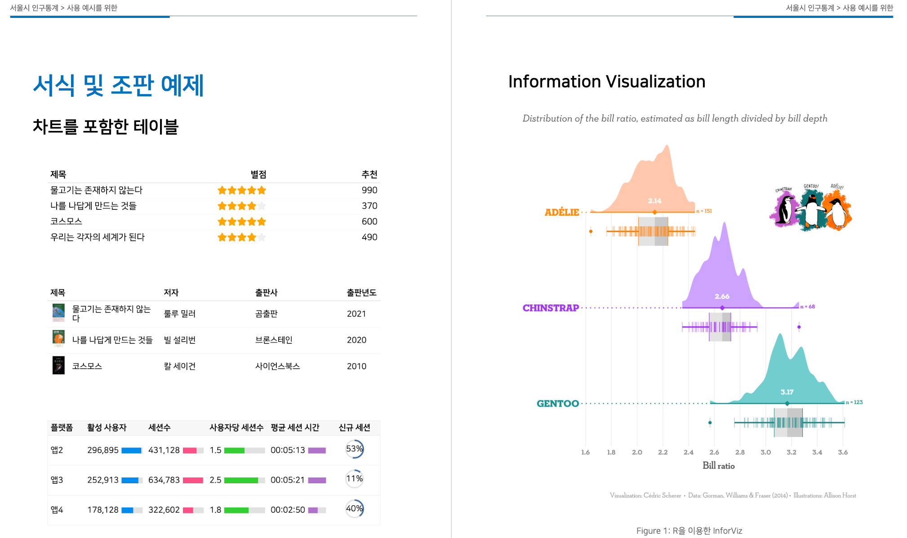
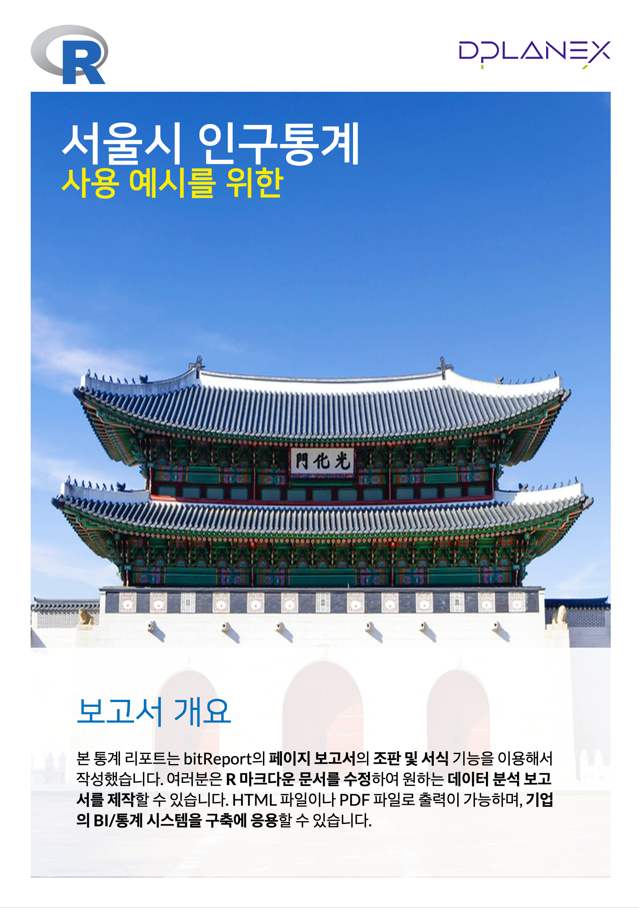

```{r setup, include=FALSE}
knitr::opts_chunk$set(echo = TRUE, 
                      message = FALSE, 
                      warning = FALSE, 
                      collapse = FALSE,
                      fig.align = "center",
                      tidy.opts = list(width.cutoff = 70), 
                      tidy = TRUE)
knitr::opts_chunk$set(fig.width = 12, fig.height = 9)

library(shiny, warn.conflicts = FALSE)
library(dplyr, warn.conflicts = FALSE)
library(ggplot2, warn.conflicts = FALSE)

xaringanExtra :: use_panelset()
```

```{r intro, echo=FALSE, out.width = "55%"}

```


```{r, preface, echo=FALSE}
div(class = "preface", 
    h4("들어가기"),
    "훌륭한 목수는 연장을 탓하지는 않습니다.", br(),
    "그러나 디지털 글쓰기 기반의 훌륭한 연장은 분석가의 잔업과 야근을 줄여줄 수 있습니다.", br(),
    "한국R사용자회의 hliReport 패키지가 분석가의 보고서 작업에 훌륭한 연장이 되기를 바랍니다.")
```

<br>


## bitReport 패키지 소개

### bitReport 패키지란

- [bitReport](https://github.com/bit2r/bitReport) 패키지는 **Reproducible Research** 기반으로 보고서를 생성할 수 있도록 도와주는 R 패키지

### bitReport 패키지의 기능과 특징

#### 패키지의 기능

* 정적 리포트 작성
  - 세로방향 PDF 페이지 문서 생성
* 동적 리포트 작성
  - 웹 페이지 생성
  - 웹 대시보드 생성
  - 웹 슬라이드 문서 생성

#### 패키지의 특징

* 보고서 템플리트 제공
  - RStudio의 메뉴로 제공
  - 제공하는 템플리트를 수정해서 보고서 생성
* 시각화 및 도표 출력 템플리트 함수 제공
  - 템플리트 자체가 사용방법 설명서 
  - 템플리트 함수를 이용하거나 수정해서 보고서에 삽입할 통계표나 플롯 출력
* 한글 폰트 포함
  - NanumSquare, D2Coding 폰트
* 웹 페이지를 스크린샷 할수 있는 프로그램 포함
  - webshot 패키지를 이용한 스크린 샷 
  
## bitReport를 이용한 정적 보고서 생성 데모

### 시나리오

- 테마
    - 블루 테마
- 커버 페이지
    - 제목: 서울시 인구통계
    - 부제목: 사용 예시를 위한
    - 로고: DPLANEX 로고
    - 커버 이미지: 광화문
- 교보문고
    - 베스트셀러 현황
    - 집계표와 내용 설명을 위한 조판
- 서식 및 조판 예제
    - 차트를 포함한 테이블
    - Information Visualization
    - 데이터 시각화 및 집계 테이블
- 서울시 인구통계
    - 면적 및 인구현황
    - 25개구별 개별 인구통계 정보
        - 하나의 조판 서식으로 25회 반복 작업
        - 공공 데이터 활용

### bitReport 기반의 보고서 

#### pdf 포맷

<a href="서울시 인구통계.pdf" target="_blank">
  
</a>

#### html 포맷

<a href="static_report.html" target="_blank">
  
</a>

### bitReport 기반의 보고서 생성 시연

- RStudio에서의 간단한 시연

